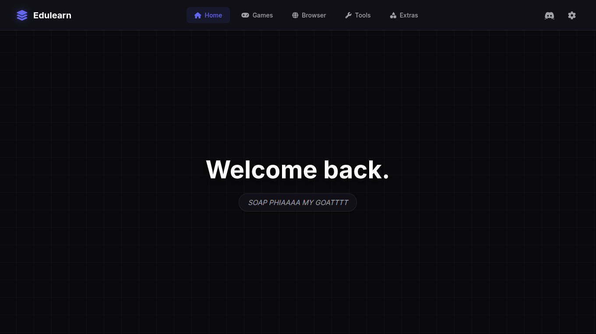

# Edulearn V5 (Beta Channel)

*Edulearn V5 - The best unblocked "OS" with many features.* 

*Edulearn Lite V5 - The Best Gaming Site.*
---

## What's New in V5

- **Dual Architecture:** A brand new entry point allowing you to choose between **Edulearn Lite** (Streamlined for Gaming) and **EdulearnOS** (Built for Productivity).
- **Midnight Theme:** A complete visual overhaul featuring deep black backgrounds (`#050505`), crisp white accents, Inter typography, and ambient particle backgrounds.
- **RNG Launcher:** Can't decide? Use the new **"Pick one for me"** button on the selection screen to launch a random environment.
- **Edulearn Lite:** A new, lightweight, fullscreen interface designed for maximum performance and lower latency in games.
- **Smart Navigation:** Intelligent history handling—going "Back" from the OS returns you to the selection screen instead of kicking you out.
- **Enhanced Info Center:** A beautiful, glassmorphism-based info page with version tracking and visual counters.

---

## Deployment Options

You can deploy Edulearn V5 on multiple static hosting platforms:

  
  
  

Or deploy manually via terminal:  

---

## Discord Server

Join our community for support, updates, and discussions:  

---

## Modes & Features

**Edulearn V5** is split into two distinct experiences to suit your needs:

### ⚡ Edulearn Lite (Default)
*Built for speed and gaming.*
- **Fullscreen Focus:** No distractions, edge-to-edge content.
- **Performance:** Optimized for lower-end Chromebooks.
- **Random Quotes:** Cycles through community quotes on the dashboard.
- **Live Counters:** Real-time online user tracking.

### 🖥️ EdulearnOS (Beta)
*Built for productivity and multitasking.*
- **Windowed Interface:** Run multiple apps at once.
- **Tools Suite:** - **Scientific Graphing Calculator:** Plot complex functions with neon visuals.
    - **"Only Lofi-Tunes":** Background music player.
    - **Gallery V2:** File management and media viewing.
- **Dual Proxies:** Ultraviolet & Scramjet integration.

---

## Usage

1. **Login:** Search for **"vibecoded"** (case-sensitive) in the fake ClassLink search bar.
   - *Note: Misspelling the password redirects you to the actual ClassLink search page to fool IT staff.*
2. **Select Mode:** - Click **Edulearn Lite** for games.
   - Click **EdulearnOS** for tools.
   - Click **"Pick one for me"** if you're feeling lucky.
3. **Navigation:** Use the sidebar in Lite mode to switch between Home, Games, Search, and Settings.
4. **Cloaking:** Use the Settings gear icon to change the Tab Title and Favicon (About:Blank cloaking included).

---

## FAQ

**Can I deploy to static hosts?** Yes! Fully optimized for Vercel, Netlify, GitHub Pages, and Cloudflare Pages. Zero backend required.

**How do I get back to the menu?** If you are in EdulearnOS, simply press your browser's "Back" button. The new navigation logic will take you back to the Version Selection screen safely.

**Is Edulearn safe for school?** Yes. It is designed as a learning hub and unblocking tool.

---

## Credits

- **Neo** – Lead Developer & Creator  
- **Claude, ChatGPT, Gemini** – AI Assistance & Refactoring
- **Conall Sadako** – Main Site Fixer  
- **genizy/breadbb** – GN-Math Library Developer  
- **RHW** – Scramjet-static Integration  
- **Albie** – Main Domain Provider
- **Night Network / AmplifyDev** - Css taken from popular site service "[Space](https://gointospace.app)"

*If we missed you in the credits, feel free to contact vibec3der at `fernproxys3@proton.me`*

**DISCLAIMER:** Send all DMCA requests to **Genizy** (GN-math owner) as the game library is imported directly from their repository.

---
## Upvote Us on [UBGHUB](https://ubghub.org/?site=EdulearnOS)