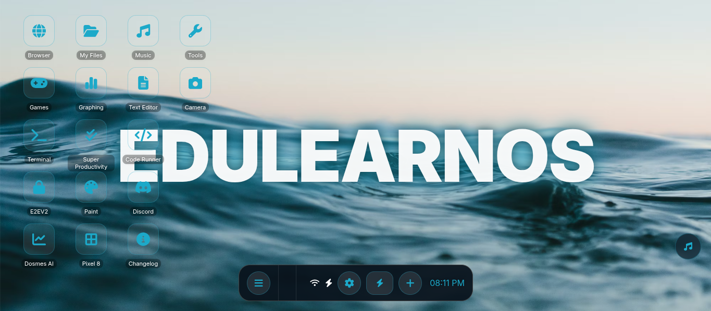

# EdulearnOS 3.1.0 (Beta Channel)

*EdulearnOS with the "Wave" wallpaper*

---

## What's New in 3.0.0 Beta

- **ULTRAVIOLET STATIC:** Web proxy for bypassing internet censorship, fast.
- **Revamped interface:** Modern glassy, iPhone-style UI for faster navigation.
- **Glassy search & shortcuts:** Non-laggy, visually appealing layout.
- **Updated tools page:** Auto-loads all tools with a clean grid.
- **Image gallery:** Browse images in `./imgs/` with modal previews.
- **Performance improvements:** Optimized for static hosts like Vercel, Netlify, & GitHub Pages.
- **Security reminder:** Copy URLs carefully; mispelling passwords may redirect to a warning page for IT spy prevention.

---

## Deployment Options

You can deploy edulearnOS on multiple static hosting platforms:

  
  
  

Or deploy manually via terminal:  

---

## Discord Server

Join our community for support, updates, and discussions:  

---

## Features

**EdulearnOS** is a fast, unblocking hub for students, featuring:

- **Dual Web Proxies - Scramjet & Ultraviolet:** High-speed unblocking for unrestricted access.  
- **GN-Math Library:**  
  - YouTube mobile ports (Bowmasters, Magic Tiles 3, Flappy Dunk, Hill Climb Racing, etc.)  
  - Drive Mad (Poki Version – 200 levels)  
  - 3D titles (Cheese Chompers 3D, Bad Parenting)  
  - Horror & Classics (All FNAFs, Bendy and the Ink Machine)  
  - Modern hits, Retro & PC ports, Multiplayer & Indie games  
- **Custom Software:** Tools for fetching and integrating almost any title.  
- **Static Site Optimized:** Fully optimized for static hosts, minimal lag.  

---

## Usage

1. **Search:** Use the search bar to find content.  
2. **Shortcuts:** Add custom shortcuts for your favorite sites or tools.  
3. **Tools Page:** Access the system tools page to launch utilities.  
4. **Image Gallery:** Browse and view images in `./imgs/`.  

> ⚠️ **Warning:** Make sure not to misspell the password. You may be redirected to a warning page to prevent IT spies.

---

## FAQ

**Can I deploy to static hosts?**  
Yes! Fully optimized for Vercel, Netlify, GitHub Pages, and Cloudflare Pages.

**How do I access launcher content?**  
Search for "vibecoded" exactly as written in Classlink.

**Is edulearnOS safe for school?**  
Yes. It is designed as a learning hub and unblocking tool in school environments.

---

## Credits

- **Neo** – Lead Developer & Creator  
- **Claude, ChatGPT, Gemini, etc.** – AI assistance  
- **Conall Sadako** – Main site fixer  
- **genizy/breadbb** – GN-Math developer  
- **RHW** – Scramjet-static integration  
- **Albie** – Main domain buyer
